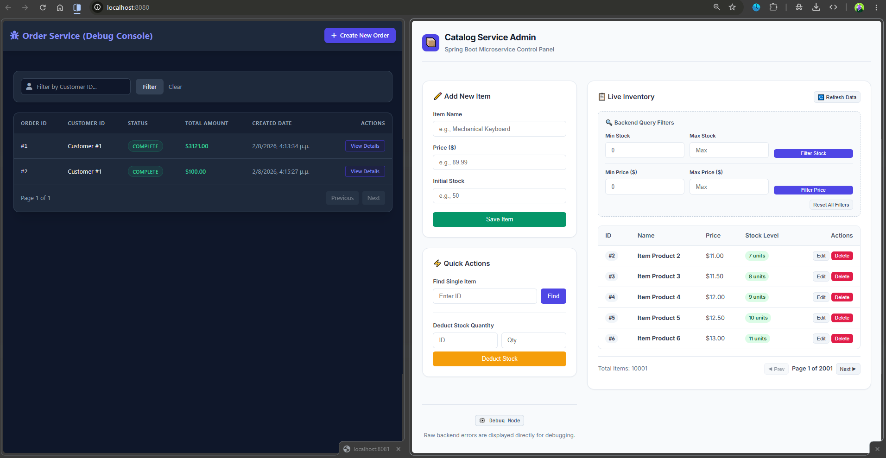
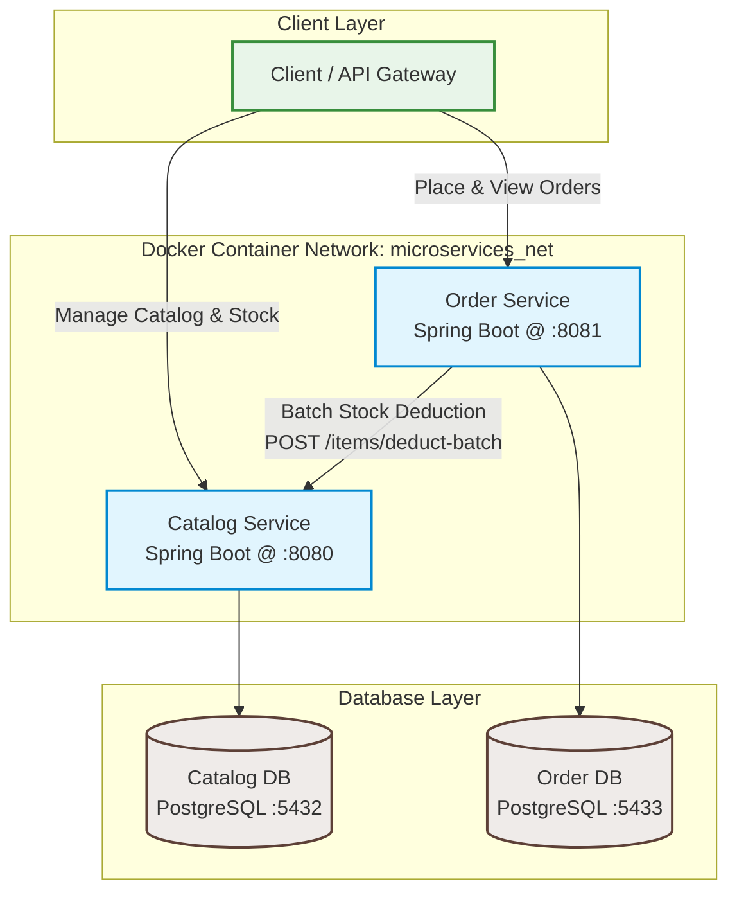
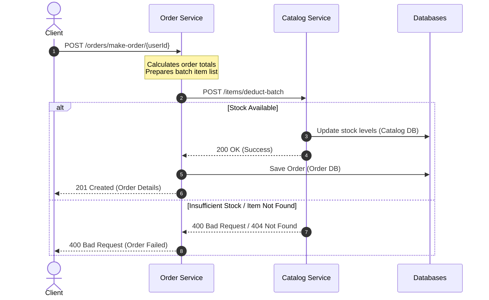
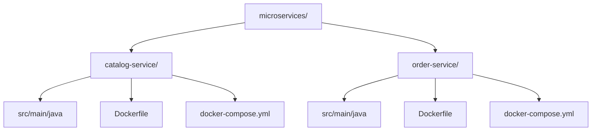

# 🛒 Shopflow

A modern, high-performance microservice-based e-commerce platform built with Spring Boot, PostgreSQL, and Docker.

---


---
##  Technology Stack
* **Runtime & Framework**: Java 25 & Spring Boot 4.1.0 (Spring Data JPA, Spring WebFlux)
* **Databases**: PostgreSQL 15 (Containerized instances)
* **Orchestration**: Docker & Docker Compose

## Architecture & Interaction Flow

The project is split into two specialized microservices communicating over a shared Docker bridge network (`microservices_net`):



### Order Placement Sequence

When a customer places an order, the system coordinates inventory validation and transaction settlement:



---

## Microservices Breakdown

| Service | Port | Database | Primary Purpose | Key Endpoints |
| :--- | :---: | :--- | :--- | :--- |
| **[Catalog Service](./catalog-service)** | `8080` | `catalog_db` (Postgres) | Product inventory, CRUD, & search | `GET /items`, `POST /items/deduct-batch` |
| **[Order Service](./order-service)** | `8081` | `Order_db` (Postgres) | Order calculation & placement | `POST /orders/make-order/{userId}`, `GET /orders` |

---

## Project Structure



---

## Future Improvements (Production Scalability)
To keep this project simple, some trade-offs were made. In a real production system, I would add:
*   **Asynchronous Messaging**: Use **Kafka** or **RabbitMQ** instead of direct HTTP calls, so the Order Service doesn't crash if the Catalog Service goes down.
*   **Data Consistency**: Implement the **Saga Pattern** to handle rollbacks if one database fails mid-order (preventing stock deduction without a saved order).
*   **API Security**: Secure internal service communication using **JWT tokens**.

---

## Quick Start

Follow these steps to spin up both microservices and their databases with docker.

### 1. Create the Shared Network
Both services need to be on the same network to talk to each other:
```bash
docker network create microservices_net
```

### 2. Configure Environment Files
Copy the `.env.example` configurations in both service directories:
```bash
# Set up Catalog Service Environment
cd catalog-service
cp .env.example .env

# Set up Order Service Environment
cd ../order-service
cp .env.example .env
```
Make sure you choose different ports for each service!

### 3. Spin Up Services
Run the containers for both microservices in separate terminal sessions or run in background:

```bash
# Run Catalog Service & its Database
cd ../catalog-service
docker compose up -d --build

# Run Order Service & its Database
cd ../order-service
docker compose up -d --build
```

---

Note: The frontend was developed with the assistance of AI tools.
All backend architecture, business logic, database design,
were implemented **BY THE AUTHOR (me).** 
