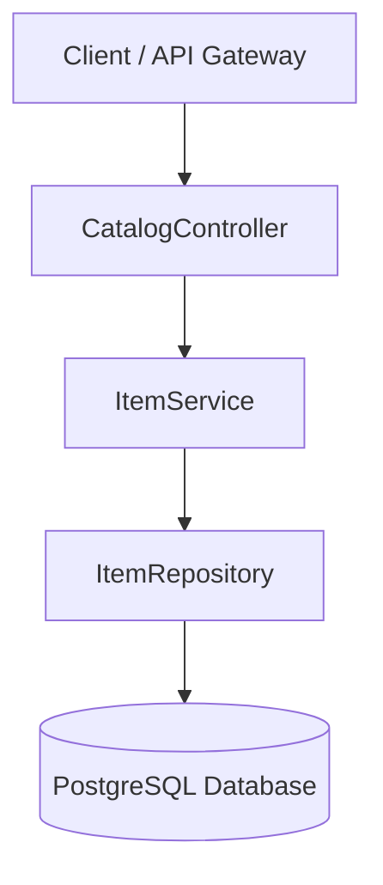

# Catalog Service 

A lightweight microservice responsible for managing the retail items catalog, inventory stock levels, and basic product search functionality.

---

## Tech Stack

* **Language:** Java 25
* **Framework:** Spring Boot 4.1.0 (Spring Data JPA, Spring Web)
* **Database:** PostgreSQL 15
* **Containerization:** Docker & Docker Compose

---

## System Architecture

The service is built using a classic layered architecture pattern to maintain a clean separation of concerns.



---

## Key Features

* **Catalog Management**: Full CRUD operations for catalog products.
* **Pagination & Filtering**: Integrated support for paginated retrieval and filtering by price or stock range.
* **Inventory Control**: Bulk and single-item stock deduction endpoints for order processing.

---

## API Endpoints

### Catalog Management
* `GET /items` - Retrieve a paginated list of all items (default size: 20)
* `GET /items/{id}` - Retrieve a specific item by ID
* `POST /items` - Add a new item to the catalog
* `PUT /items/update/{id}` - Update an existing item's details
* `DELETE /items/delete/{id}` - Remove an item from the catalog

### Search & Filtering
* `GET /items/by-stock-range?minStock=0&maxStock=100` - Filter items by stock levels (paginated)
* `GET /items/by-price-range?minPrice=0&maxPrice=1000` - Filter items by price range (paginated)

### Stock Operations
* `GET /items/Stock/{id}` - Retrieve stock information for a specific item
* `POST /items/{id}/deduct?quantity=5` - Deduct stock for a single item
* `POST /items/deduct-batch` - Bulk stock deduction for order transactions

---

## 💻 Local Setup & Execution

### 1. Prerequisites
Ensure you have the following installed:
* Docker & Docker Compose
* JDK 25 (if running without Docker)
* Maven (if running without Docker)

### 2. Environment Configuration
Copy the template env file:
```bash
cp .env.example .env
```
And populate `.env` with your desired configuration parameters.

### 3. Run with Docker Compose
Create the shared microservices network if it doesn't already exist:
```bash
docker network create microservices_net
```

Start the application stack (PostgreSQL + Catalog Service):
```bash
docker compose up -d --build
```
The service will be accessible on the port defined in your `.env` file (maps internally to `8080`).
