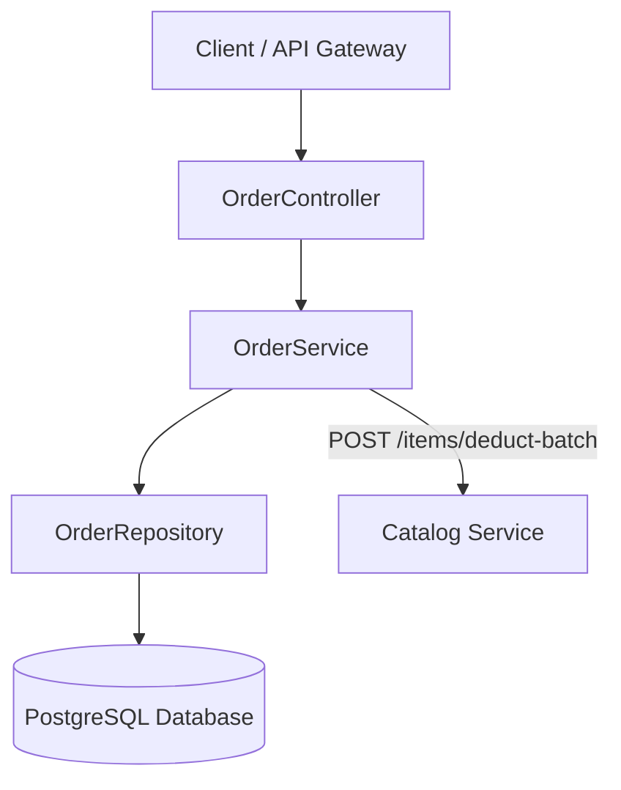

# Order Service

A lightweight microservice responsible for processing customer orders, managing order items, calculating order totals, and coordinating with the Catalog Service for stock deduction.

---

## Tech Stack

* **Language:** Java 25
* **Framework:** Spring Boot 4.1.0 (Spring Data JPA, Spring Web, Spring WebFlux)
* **Database:** PostgreSQL 15
* **Containerization:** Docker & Docker Compose

---

## System Architecture

The service is built using a classic layered architecture pattern and communicates with external catalog/item services for stock validation.



---

## Key Features

* **Order Processing**: Place customer orders with multiple item details and auto-calculate total order amounts.
* **Catalog Integration**: Synchronously interacts with the Catalog Service to perform bulk stock deduction.
* **Paginated History**: Retrieve full orders and customer-specific purchase history with built-in pagination support.

---

## API Endpoints

### Order Placement
* `POST /orders/make-order/{userId}` - Place a new order (automatically performs inventory validation and batch deduction)

### Order Retrieval & History
* `GET /orders` - Retrieve a paginated list of all orders (default size: 20)
* `GET /orders/{id}` - Retrieve a specific order by ID
* `GET /orders/customer/{id}` - Retrieve a paginated list of orders for a specific customer (default size: 10)

---

## 💻 Local Setup & Execution

### 1. Prerequisites
Ensure you have the following installed:
* Docker & Docker Compose
* JDK 25 (if running without Docker)
* Maven (if running without Docker)

### 2. Environment Configuration
Copy the template env file:
```bash
cp .env.example .env
```
And populate `.env` with your desired configuration parameters.

### 3. Run with Docker Compose
Create the shared microservices network if it doesn't already exist:
```bash
docker network create microservices_net
```

Start the application stack (PostgreSQL + Order Service):
```bash
docker compose up -d --build
```
The service will be accessible on the port defined in your `.env` file (maps internally to `8080`).
